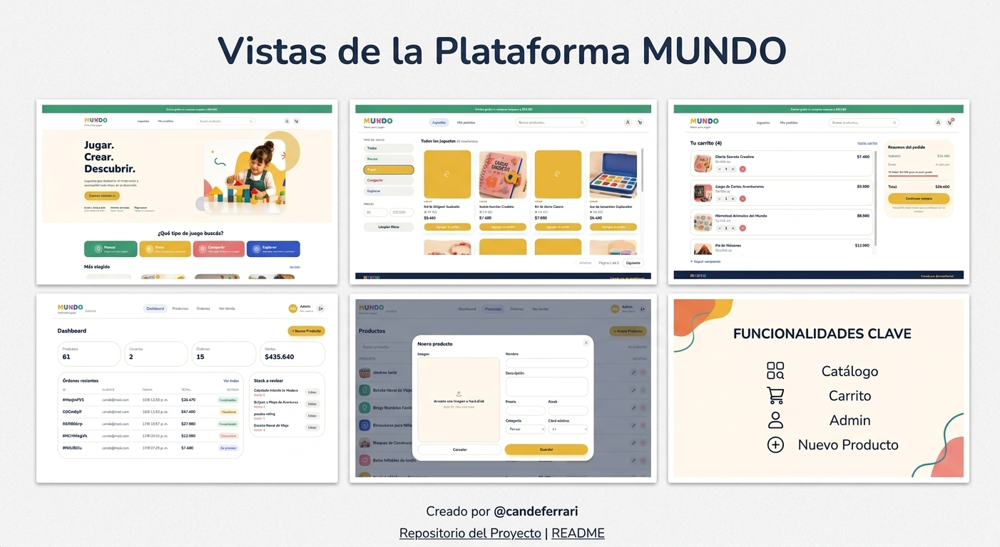
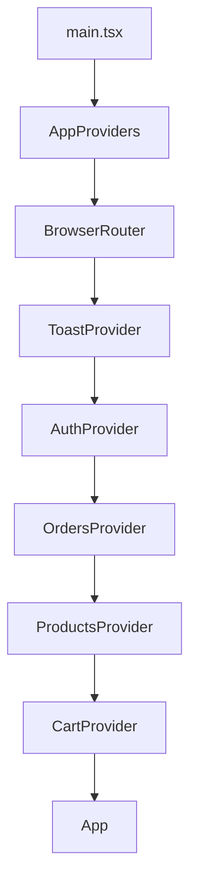

# MUNDO — E-commerce de juguetería

Proyecto Integrador del Módulo 5 (Especialización Frontend, Henry): un e-commerce completo con dos experiencias diferenciadas — la de quien compra y la de quien administra el catálogo y las órdenes — construido con **React + TypeScript**, **Firebase** (Auth + Firestore), **AWS S3** para imágenes de producto y deploy en **Vercel**.

> 🔗 **Producción:** https://proyecto-m5-candelaria-ferrari.vercel.app/
> 📁 **Repo:** https://github.com/candelariaferrari/proyectoM5_CandelariaFerrari

## Contexto del proyecto

MUNDO es una juguetería ficticia. La consigna del Módulo 5 pide construir el e-commerce completo de un cliente real: catálogo navegable, carrito, checkout, cuentas de usuario y un panel de administración para gestionar productos y pedidos — con dos roles claramente separados (`customer` y `admin`) y las tres integraciones externas que exige un e-commerce de verdad (autenticación, base de datos y almacenamiento de imágenes).

## Índice

- [Capturas](#capturas)
- [Stack](#stack)
- [Funcionalidades](#funcionalidades)
- [Arquitectura y decisiones](#arquitectura-y-decisiones)
- [Estructura de carpetas](#estructura-de-carpetas)
- [Cómo correr el proyecto](#cómo-correr-el-proyecto)
- [Variables de entorno](#variables-de-entorno)
- [Subida de imágenes a S3 (presigned URLs)](#subida-de-imágenes-a-s3-presigned-urls)
- [Testing](#testing)
- [Deploy](#deploy)
- [Bitácora de uso de IA](#bitácora-de-uso-de-ia)

## Capturas



## Stack

| Capa | Tecnología |
|---|---|
| Frontend | React 18 + TypeScript + Vite |
| Ruteo | React Router DOM v7 |
| Estado global | Context API + `useReducer` (carrito) |
| Estilos | Tailwind CSS v4 (tokens de diseño propios vía `@theme`) |
| Autenticación | Firebase Authentication (email/contraseña + Google) |
| Base de datos | Firestore |
| Imágenes | AWS S3 (subida directa con presigned URLs) |
| Backend serverless | Vercel Functions (`api/presign.ts`) |
| Testing | Vitest + React Testing Library |
| Lint | ESLint (typescript-eslint + react-hooks + react-refresh) |
| Deploy | Vercel |

## Funcionalidades

**Cliente**

- Home con hero, categorías destacadas y "más elegidos"; catálogo (`/productos`) separado, con filtro por categoría (sincronizado en la URL vía `?categoria=`), filtro por precio y búsqueda por nombre con debounce.
- Detalle de producto con selector de cantidad.
- Carrito persistente en memoria por usuario (incluye carrito de invitado, fusionado automáticamente al iniciar sesión), con scroll interno propio en desktop para que el resumen y el footer queden siempre visibles.
- Registro / login (email y contraseña, y Google) con mensajes de error traducidos y validaciones propias en los formularios.
- Checkout con paso de revisión y confirmación, que crea la orden en Firestore con un snapshot de los productos comprados (nombre y precio "congelados" al momento de la compra).
- "Mis pedidos", con historial paginado (10 por página) e items de cada orden.
- Estados de carga con skeletons (en vez de texto de "Cargando...") en todas las pantallas que dependen de Firestore.

**Administración** (rutas bajo `/admin`, protegidas por rol)

- Dashboard con métricas reales (productos, usuarios, órdenes, ventas totales — excluyendo canceladas), órdenes recientes y stock a revisar (productos por debajo del umbral configurado).
- CRUD completo de productos, con paginación por cursor, filtro por categoría, búsqueda y subida de imagen a S3.
- Gestión de órdenes con vista maestro-detalle, filtro por estado, paginación (10 por página) y cambio de estado siguiendo una máquina de estados simple (`pending → processing → completed`, con `cancelled` como salida en cualquier punto no terminal).

## Arquitectura y decisiones

### Por qué Context API + `useReducer` para el carrito

El carrito es el estado más complejo del proyecto: varias acciones posibles (agregar, quitar, actualizar cantidad, vaciar, fusionar el carrito de invitado al loguearse), todas mutando la misma estructura de datos. `useReducer` centraliza esa lógica en una única función pura (`cartReducer`, en `src/contexts/cartReducer.ts`): recibe el estado actual y una acción, y devuelve el estado siguiente, sin depender de nada externo. Eso trae dos ventajas concretas frente a repartir la lógica en varios `setState`:

- **Es trivial de testear**: un reducer puro se prueba pasándole un estado de entrada y una acción, y comparando contra el estado esperado — sin renderizar componentes ni mockear Firebase.
- **Es la única fuente de verdad de "cómo cambia el carrito"**: cualquier bug de lógica del carrito se debuggea en un solo archivo, no rastreando `setCartsByUser` desparramados.

`CartContext` se queda solo con el `dispatch(...)` y los side effects que no pueden vivir dentro de un reducer puro (mostrar un toast, por ejemplo). El carrito original se armó con `useState` y se refactorizó a `useReducer` antes de escribir los tests — el detalle de esa decisión está en `bitacora_ia.md`.

### Por qué presigned URLs para las imágenes (y no subirlas desde el servidor)

Las credenciales de AWS nunca deben llegar al navegador. El flujo implementado es:

1. El navegador le pide a una Vercel Function propia (`api/presign.ts`) permiso para subir un archivo, mandando solo el nombre y el tipo.
2. Esa función es la única parte del sistema que tiene las credenciales de AWS (variables de entorno del servidor, **sin** el prefijo `VITE_`, así Vite nunca las empaqueta en el JS que baja el navegador). Con esas credenciales le pide a S3 una URL firmada que autoriza *un único* `PUT`, a *una única* ubicación, y que expira en 60 segundos.
3. El navegador usa esa URL para subir el archivo **directo a S3** (sin pasar por ningún servidor propio).
4. La URL pública resultante se guarda en Firestore como `imageUrl` del producto.

Ver el detalle completo en [Subida de imágenes a S3](#subida-de-imágenes-a-s3-presigned-urls) más abajo.

### Roles de usuario

Firebase Authentication resuelve la identidad, pero no el rol — eso vive en Firestore (`users/{uid}.role`). No existe ningún código, ni de cliente ni de servidor, que pueda asignar `role: "admin"`: `createUserProfile` (`users.services.ts`) crea todo perfil nuevo siempre como `"customer"`, sin excepción. Las reglas de Firestore (`firestore.rules`) además bloquean por completo cualquier `update` sobre `users/{userId}` (`allow update, delete: if false`), así que ni siquiera un admin puede cambiarle el rol a otro usuario *desde la app*. La única forma de crear un administrador es editando ese campo a mano en la consola de Firebase, con acceso de administrador real fuera de la app — el seeder (`scripts/seed.ts`), por ejemplo, no crea al admin: inicia sesión con las credenciales de un admin que ya tiene que existir de antes (`SEED_ADMIN_EMAIL`/`SEED_ADMIN_PASSWORD`), y usa esa sesión para poder escribir productos. Este diseño responde directamente a que el rol de admin no puede quedar hardcodeado en ningún lugar del código: no hay ninguna ruta, ni siquiera indirecta, para que alguien se autoasigne el rol.

Las rutas se protegen con un único componente reutilizable, `ProtectedRoute` (`src/routes/ProtectedRoute.tsx`), con dos niveles: sesión requerida (`/confirmar-compra`, `/pedidos`, `/pedido-confirmado`) y sesión + rol admin (`/admin/*`). Mientras Firebase todavía no confirmó si hay una sesión guardada (`loading`), no se redirige a nadie — evita que un admin que recarga `/admin` rebote a `/` un instante antes de que responda `onAuthStateChanged`.

### Árbol de Providers



El orden `AuthProvider → OrdersProvider → ProductsProvider → CartProvider` no es arbitrario: `OrdersProvider` necesita leer `useAuth()` para saber quién es el usuario y si es admin (así decide si trae solo sus propias órdenes o todas), y `CartProvider` necesita leer `useAuth()` para implementar el carrito por usuario (cada `uid` tiene el suyo, y un usuario sin sesión usa la clave `"guest"`). Como React resuelve el contexto más cercano hacia arriba en el árbol, `OrdersProvider` y `CartProvider` tienen que estar anidados dentro de `AuthProvider` — toda la UI que muestra o modifica órdenes (páginas de cliente y de admin) lee este contexto en vez de pedirle datos directo a Firestore.

### Layer-based, no feature-based

El código se organiza por tipo de responsabilidad (`components`, `pages`, `hooks`, `contexts`, `services`, `types`), no por dominio/feature. Se evaluaron ambas alternativas al arrancar el proyecto: una estructura feature-based (`features/cart`, `features/auth`, etc.) generaría dependencias cruzadas difíciles de evitar — el carrito necesita leer autenticación, el admin reutiliza componentes del catálogo — y para el tamaño actual del proyecto agregaría más complejidad de la que resuelve. El razonamiento completo, con las alternativas comparadas, está documentado en `bitacora_ia.md`.

### Paginación por cursor, genérica

`useCursorPagination<T, C>` (`src/hooks/`) no sabe nada de ningún dominio: recibe funciones `fetchPage`/`fetchCount` y resuelve la mecánica de cursores de Firestore, la página actual y el reseteo a la página 1 cuando cambia un filtro. `useProductsPagination` es una capa fina arriba que la conecta con `products.services.ts`. Se separó así después de necesitar la misma paginación en dos lugares (catálogo de cliente y tabla de productos del admin) — extraer la parte genérica evita reescribir la lógica de cursores cada vez que aparezca un tercer lugar.

Las órdenes, en cambio, se paginan distinto: `OrdersContext` ya trae todas las órdenes del usuario (o todas las de la app, si es admin) de una sola vez, así que ahí alcanza con un slice simple en memoria sobre el array ya cargado, reutilizando el mismo componente visual `<Pagination>` — no hace falta la mecánica de cursores de Firestore porque no hay una segunda consulta de por medio.

## Estructura de carpetas

```text
src/
  components/
    admin/        # layout y formularios propios del panel de administración
    auth/          # modal de login/registro
    layout/        # Header, Footer, BottomTabBar (estructura de página)
    orders/        # piezas compartidas entre "Mis pedidos" y el admin de órdenes
    products/      # grilla, card, filtros y skeletons de producto
    ui/            # piezas genéricas sin lógica de negocio (Button, Modal, Toast, Skeleton, Pagination...)
  config/          # inicialización de Firebase
  constants/       # fuente única de verdad de categorías, estados de orden, umbral de stock
  contexts/        # Context + Provider de cada dominio, y el reducer puro del carrito
  hooks/           # hooks de consumo (con guard fuera del Provider) y paginación
  pages/           # componentes de pantalla completa (cliente y admin)
  routes/          # definición de rutas y ProtectedRoute
  services/        # integraciones externas: Firestore (products/orders/users) y S3 (upload)
  types/           # contratos de TypeScript compartidos
  utils/           # helpers puros (formato de moneda, traducción de errores de Firebase Auth)

api/
  presign.ts       # Vercel Function: genera la presigned URL de S3

scripts/
  seed.ts          # carga los 60 productos base (y sus imágenes) en Firestore/S3

test/
  hooks/           # tests de guard y de lógica de cada hook
  contexts/        # tests de integración entre providers (incluye cartReducer.test.ts)
  pages/           # tests de páginas completas (ej. CheckoutConfirmPage y su guard anti-doble-submit)
  routes/          # tests de ruteo real: páginas públicas, rutas protegidas y admin según el rol
  services/        # tests de la capa de integración con Firestore/S3 (products, orders, users, upload)
  utils/           # tests de helpers puros (ej. traducción de errores de Firebase Auth)
  integration/     # flujos completos (ej. agregar al carrito)
```

## Cómo correr el proyecto

### 1. Clonar e instalar

```bash
git clone https://github.com/candelariaferrari/proyectoM5_CandelariaFerrari.git
cd proyectoM5_CandelariaFerrari
npm install
```

### 2. Crear un proyecto de Firebase

1. Crear un proyecto en la [consola de Firebase](https://console.firebase.google.com/).
2. Habilitar **Authentication** → método Email/contraseña y Google.
3. Habilitar **Firestore Database** (modo producción).
4. Desplegar las reglas de seguridad del repo (`firestore.rules`) desde la consola o con la Firebase CLI (`firebase deploy --only firestore:rules`).
5. Registrar una app Web dentro del proyecto de Firebase y copiar las credenciales (`apiKey`, `authDomain`, etc.) a las variables `VITE_FIREBASE_*` del `.env` (ver [Variables de entorno](#variables-de-entorno)).

### 3. Crear el bucket de S3

1. Crear un bucket en AWS S3 (privado por default).
2. Agregar una política de bucket que permita **lectura pública** (`s3:GetObject`) únicamente dentro de la carpeta `imgProducts/`.
3. Crear un usuario de IAM aparte (no la cuenta raíz) con permiso únicamente para **escribir** (`s3:PutObject`) en esa misma carpeta.
4. Configurar CORS en el bucket para permitir el `PUT` directo desde el navegador (origen de desarrollo y el de producción en Vercel).
5. Copiar el nombre del bucket, la región y las credenciales del usuario de IAM a las variables `AWS_*` del `.env`.

### 4. Variables de entorno

Copiar `.env.example` a `.env` y completar los valores reales:

```bash
cp .env.example .env
```

Ver el detalle de cada variable en [Variables de entorno](#variables-de-entorno).

### 5. Cargar datos de ejemplo (opcional)

El seeder inicia sesión como un usuario administrador que ya tiene que existir de antes. Tienen que corresponder a un usuario ya registrado en Firebase Authentication, con `role: "admin"` asignado a mano en Firestore y, usando esa sesión, sube los 60 productos base a Firestore:

```bash
npm run seed
```

### 6. Correr el proyecto

```bash
npm run dev          # servidor de desarrollo
npm run test:run     # corre los tests una vez
npm run test          # tests en modo watch
npm run test:coverage # tests con reporte de cobertura
npm run lint          # ESLint
npm run build          # build de producción (tsc -b && vite build)
```

Las funciones serverless de `api/` (usadas para las presigned URLs) no corren con `npm run dev` — necesitan la Vercel CLI (`npm install -g vercel`, `vercel login`, `vercel dev`) o probarse directo contra un deploy real.

## Variables de entorno

| Variable | Dónde se usa | Descripción |
|---|---|---|
| `VITE_FIREBASE_API_KEY` | Frontend | Config de Firebase (app Web) |
| `VITE_FIREBASE_AUTH_DOMAIN` | Frontend | Config de Firebase |
| `VITE_FIREBASE_PROJECT_ID` | Frontend | Config de Firebase |
| `VITE_FIREBASE_STORAGE_BUCKET` | Frontend | Config de Firebase |
| `VITE_FIREBASE_MESSAGING_SENDER_ID` | Frontend | Config de Firebase |
| `VITE_FIREBASE_APP_ID` | Frontend | Config de Firebase |
| `AWS_REGION` | Vercel Function / seeder | Región del bucket de S3 |
| `AWS_ACCESS_KEY_ID` | Vercel Function / seeder | Credencial del usuario de IAM (solo `PutObject`) |
| `AWS_SECRET_ACCESS_KEY` | Vercel Function / seeder | Credencial del usuario de IAM |
| `AWS_S3_BUCKET_NAME` | Vercel Function / seeder | Nombre del bucket |


Las variables `VITE_*` son las únicas que Vite empaqueta en el frontend — por eso son las únicas con ese prefijo. Todas las demás solo existen del lado del servidor (Vercel Functions) o en la máquina donde se corre el seeder, y nunca deberían tener el prefijo `VITE_`.

`.env` está en `.gitignore` y nunca se sube al repositorio; `.env.example` sí, sin valores reales.

## Subida de imágenes a S3 (presigned URLs)

```text
Admin sube una imagen en el form de producto
        │
        ▼
1) Frontend → POST /api/presign { filename, fileType }
        │
        ▼
2) api/presign.ts (Vercel Function, tiene las credenciales de AWS)
   valida el tipo de archivo, arma una key única
   (imgProducts/{uuid}-{filename}) y pide a S3 una
   presigned URL que autoriza SOLO ese PUT, expira en 60s
        │
        ▼
3) Frontend → PUT {uploadUrl} con el archivo (directo a S3,
   sin pasar por ningún servidor propio)
        │
        ▼
4) Frontend guarda la publicUrl devuelta como imageUrl del
   producto en Firestore
```

Las credenciales de AWS solo existen en `api/presign.ts` (variables de entorno del servidor) y en `scripts/seed.ts` (que corre en Node, nunca en el navegador) — en ningún momento llegan al bundle que se manda al cliente. Si un producto no tiene imagen (o la que tiene falla al cargar), `ProductImage` muestra un cuadrado del color de su categoría en vez del ícono de imagen rota del navegador.

## Testing

```bash
npm run test:run       # una corrida
npm run test:coverage  # con reporte de cobertura (v8)
```

La estrategia prioriza lo que más costaría que se rompiera silenciosamente:

- **`cartReducer`**: cada acción (`ADD_TO_CART`, `REMOVE_FROM_CART`, `UPDATE_QUANTITY`, `CLEAR_CART`, `MERGE_GUEST_CART`) probada como función pura, sin renderizar nada.
- **Hooks y Contexts de consumo** (`useAuth`/`AuthContext`, `useCart`/`CartContext`, `useOrders`/`OrdersContext`, `useProducts`): se verifica que el guard lanza el error correspondiente cuando se usan fuera de su Provider (con `renderHook`), y además el comportamiento real de cada Provider (login/signup/logout, altas y cambios de estado de órdenes según el rol, etc.).
- **Servicios** (`products.services`, `orders.services`, `users.services`, `upload.services`): cada función que habla con Firestore o con la API de presigned URLs, probada con esas dependencias mockeadas.
- **Páginas críticas para el negocio**: `CheckoutConfirmPage` tiene un test dedicado a que no se pueda generar una orden duplicada haciendo doble click en "Confirmar compra".
- **Ruteo**: `AppRoutes` prueba las páginas públicas, las protegidas con y sin sesión, y `/admin` según el rol (`customer` vs `admin`) sobre el árbol real de providers.
- **Integración**: al menos un flujo completo (agregar al carrito) sobre el árbol real de providers, con Firebase mockeado globalmente (`test/setupTests.ts`) para que ningún test dependa de una conexión real.

Los tests viven en `test/`, separados de `src/`, replicando su estructura — decisión de organización personal, documentada en el `README` original y en `bitacora_ia.md`.

## Deploy

El proyecto está pensado para desplegarse en Vercel:

1. Conectar el repositorio de GitHub a un proyecto de Vercel.
2. Cargar las mismas variables de entorno del `.env` en la configuración del proyecto en Vercel (Settings → Environment Variables).
3. `vercel.json` incluye un rewrite para que cualquier ruta que no sea `/api/*` sirva `index.html` — necesario porque React Router maneja las rutas en el navegador, y sin este rewrite recargar una ruta que no sea `/` (por ejemplo `/carrito` o `/admin`) devuelve 404 antes de que React llegue a cargar.

**URL de producción:** https://proyecto-m5-candelaria-ferrari.vercel.app/

## Bitácora de uso de IA

El registro completo (más de 25 entradas, con prompt, alternativas evaluadas y decisión final) está en [`bitacora_ia.md`](./bitacora_ia.md). La IA se usó para comparar alternativas, entender errores y validar decisiones — no como reemplazo del desarrollo. Algunos de los momentos más representativos:

| Tema | Qué se consultó | Qué se aprendió / decidió |
|---|---|---|
| **Planificación** — estructura de carpetas | Layer-based vs. feature-based, comparando mantenibilidad y dependencias cruzadas | Se eligió layer-based: una estructura por feature generaría dependencias cruzadas difíciles de evitar (el carrito necesita leer `Auth`) para el tamaño actual del proyecto |
| **Validación de decisión técnica** — `useReducer` vs. `useState` en el carrito | Al escribir los tests del carrito se detectó que no existía ningún reducer puro para testear, porque `CartContext` todavía usaba `useState` | Se refactorizó el carrito completo a `useReducer` *antes* de escribir los tests, extrayendo `cartReducer` como función pura — la consigna lo pedía explícitamente y es más fácil de testear de forma aislada |
| **Generación de tests / code review** — memoización de `CartContext` | ESLint marcaba dependencias faltantes en el `useMemo` del `value` del contexto; agregarlas generaba un loop porque las funciones se recreaban en cada render | Se aplicó `useCallback` a las acciones del carrito para estabilizar sus referencias — el warning de ESLint señalaba un problema real, no solo ruido |
| **Resolución de problemas** — desborde horizontal en mobile | `position: fixed` en el panel de resumen del carrito generaba scroll horizontal que persistía incluso al cambiar de ruta | Se identificaron dos causas (`min-width` implícito de un `grid` sin columnas definidas + `overflow-hidden` que no contiene elementos `fixed`) y se resolvió moviendo `overflow-x: hidden` a `html`/`body` |
| **Resolución de problemas** — reglas de seguridad de Firestore | El admin no podía listar órdenes ni usuarios (`Missing or insufficient permissions`), aunque la regla `request.auth.uid == userId` parecía correcta | Se aprendió la diferencia entre `get` (documento puntual) y `list` (query sobre la colección) en las reglas de Firestore: una condición que solo es cierta para el propio documento no alcanza para autorizar un `list`, hace falta una condición (`isAdmin()`) que Firestore pueda garantizar para toda la colección |
| **Validación de decisión de producto** — carrito de invitado | ¿Bloquear el carrito hasta loguearse, o dejar armarlo como invitado? | Se eligió permitir el carrito de invitado (mejor UX, estándar en e-commerce real) y fusionarlo con el del usuario en el momento del login — con el detalle de detectar ese instante exacto usando un `useRef` |

