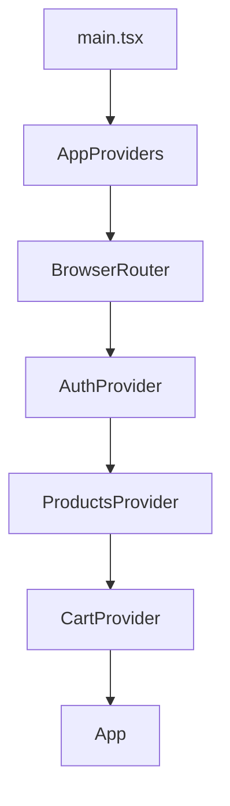

# Patagonix — E-commerce Kickoff (Módulo 5)

Bases arquitectónicas de un e-commerce escalable, construidas con **Vite + React 18 + TypeScript** y **Context API** como estado global. Homework de la Clase 1 del Módulo 5 — el objetivo es la arquitectura (capas, contexts, hooks con guards), no una tienda funcional completa.

## Stack

- React 18 + TypeScript + Vite
- React Router DOM (navegación)
- Tailwind CSS v4 (tokens de diseño de Patagonix — paleta, tipografía Manrope, radios, sombras)
- Context API (estado global)
- Vitest + React Testing Library (tests)
- ESLint (typescript-eslint + react-hooks + react-refresh)

Pensado para escalar en los próximos módulos con Firebase Authentication + Firestore, AWS S3 (imágenes) y Vercel (deploy). Por eso `services/` existe como carpeta reservada aunque hoy no tenga contenido: es el lugar donde va a vivir la integración real, sin tener que tocar `contexts/` ni los componentes cuando eso pase.

## Cómo correr el proyecto

```bash
npm install
npm run dev        # servidor de desarrollo
npm run test:run    # corre los tests una vez
npm run test        # tests en modo watch
npm run lint         # eslint
npm run build         # build de producción
```

## Estructura de carpetas

```
src/
  components/        # componentes de dominio y layout (no genéricos de UI)
    layout/           # "carcasa" de la página (Header, etc.)
    ui/               # piezas genéricas reutilizables (sin lógica de negocio)
  contexts/          # Context + Provider de cada dominio, y AppProviders
  hooks/             # custom hooks de consumo, con guard fuera del provider
  pages/             # componentes de página (componen otros componentes)
  types/             # contratos de TypeScript compartidos
test/
  hooks/             # tests de guard de cada hook
  contexts/          # tests de integración entre providers
```

## Árbol de Providers



### Justificación del orden

El orden `AuthProvider → ProductsProvider → CartProvider` no es arbitrario: `CartProvider` necesita poder leer `useAuth()` para implementar el carrito por usuario (cada `uid` tiene su propio carrito, y un invitado sin loguear tiene el suyo aparte). Como React resuelve el contexto más cercano hacia arriba en el árbol, `CartProvider` solo puede llamar a `useAuth()` sin que explote el guard si efectivamente está anidado **dentro** de `AuthProvider`. Si el orden se invirtiera, `useAuth()` llamado desde `CartProvider` lanzaría el error de "usado fuera del provider", porque no habría ningún `AuthProvider` ancestro en ese punto del árbol.

`ProductsProvider` no depende hoy de `Auth` ni de `Cart`, así que su posición en el medio es más una cuestión de agrupar responsabilidades relacionadas que una dependencia estricta.

## Justificación de capas

- **`types/`**: los contratos (`Product`, `CartItem`, `User`) se definieron antes que cualquier lógica, para tener un lenguaje común entre contexts, hooks y componentes desde el principio.
- **`contexts/`**: cada Context vive junto a su Provider en el mismo archivo (`AuthContext.tsx`, `CartContext.tsx`, `ProductsContext.tsx`) — decisión consciente de no separarlos (ver "Qué hice distinto"). `AppProviders.tsx` también vive acá porque su única responsabilidad es componer los tres providers.
- **`hooks/`**: los custom hooks de consumo (`useAuth`, `useCart`, `useProducts`) están separados de los contexts en su propia carpeta, porque tienen una responsabilidad distinta (cómo se consume el estado de forma segura, con guard) de la de los contexts (cómo se guarda y comparte el estado).
- **`components/`**: solo componentes de dominio que conocen los tipos del negocio (`ProductCard`, `ProductGrid`). Se subdividen en `layout/` (estructura de página, como `Header`) y `ui/` (piezas genéricas sin lógica de negocio, reservada para más adelante).
- **`pages/`**: componen componentes de dominio en una pantalla completa (`ProductsPage`).
- **`services/`**: vacía por ahora a propósito — es la capa donde va a vivir la integración real con Firebase/AWS cuando corresponda, para que cambiar de mock a servicio real no obligue a tocar contexts ni componentes.
- **`test/`**: carpeta separada de `src/` (no co-ubicada), replicando la forma interna — decisión de consistencia personal (ver "Qué hice distinto").

## Qué hice distinto y por qué

- **Hooks separados de los Contexts** en una carpeta `hooks/` propia, en vez de definirlos en el mismo archivo como en los videos. Separa "cómo se comparte el estado" de "cómo se consume de forma segura", y permitió testear los guards de forma aislada con `renderHook` sin depender del Provider.
- **Carpeta `test/` separada de `src/`**, replicando la estructura interna, en vez de tests co-ubicados junto a cada archivo — preferencia personal por consistencia con proyectos anteriores.
- **Convención de nombres por sufijo** (`AuthContext.tsx`, `useAuth.ts`, `product.types.ts`) en vez de organizar por dominio con carpetas y barrel files (`index.ts`) — evaluado y descartado por ser exceso de estructura para el tamaño actual del proyecto.
- **Conventional Commits** desde el primer commit, en vez de mensajes libres.
- **`CartItem` con el `Product` completo embebido**, en vez de guardar solo `productId` — se evaluó la alternativa (evitaría datos desactualizados si cambia el precio/stock) pero se mantuvo embebido porque así se ve en el curso.
- **Invitados pueden armar el carrito sin loguearse**; el login se exige recién en el checkout — decisión de UX basada en cómo funciona la mayoría de los e-commerce reales, para no generar fricción antes de que la persona decida comprar.
- **`displayName` opcional** en `User` (en vez de un `name` obligatorio), alineado al campo real que expone Firebase Authentication, contemplando que puede no existir.
- **`uid` en vez de `id`** en `User`, también para calzar 1 a 1 con el objeto que devuelve Firebase Auth.

## Bitácora de IA

El registro completo de prompts, sugerencias y decisiones (incluyendo qué se aceptó y qué se rechazó, con la razón) está en [`bitacora_ia.md`](./bitacora_ia.md). Algunos highlights:

- **Estructura de carpetas**: se consultó Layer-based vs Feature-based; se eligió Layer-based porque encaja con el tamaño actual del proyecto y con las carpetas que pide el checklist.
- **Modelo de datos (`User`)**: se pidió una revisión de `Product`/`CartItem`/`User`; se aceptaron las mejoras de `category`, `rating`, sacar `password`, y modelar guest como `user: null`; se rechazó la sugerencia de guardar solo `productId` en `CartItem`.
- **Composición de `AppProviders` y riesgos de re-render**: al memoizar el `value` de `CartContext` con `useMemo`, ESLint marcó dependencias faltantes; en vez de solo silenciar el warning, se aplicó la solución completa envolviendo las acciones del carrito en `useCallback`, para que la memoización sea real y no se recalcule en cada render. También se evaluó (y descartó) separar `Context` de `Provider` en archivos distintos, y crear una carpeta `providers/` para `AppProviders` — ambas rechazadas por agregar estructura innecesaria para el tamaño actual del proyecto.

### IA Driven: Revisión del modelo de datos y composición de providers

**Prompt 1 (modelo de datos):** se le pidió a la IA que criticara el primer borrador de `Product`, `CartItem` y `User` (campos, optionality, relaciones, naming), pensando en la futura integración con Firebase.

**Prompt 2 (providers):** se auditó el orden de `AppProviders` (por qué `AuthProvider` va primero, ya que `CartProvider` necesita leer `useAuth`) y los riesgos de re-render en `CartContext` (memoización de `value` con dependencias faltantes), además de evaluar alternativas de desacople (¿separar Context de Provider? ¿carpeta `providers/` propia?).

**Resultado aplicado:** se corrigieron los tipos según el Prompt 1; se agregó `AuthProvider` al `AppProviders` (había quedado afuera por error) y se envolvieron las acciones del carrito en `useCallback` para resolver de raíz el problema de re-render detectado por ESLint.

**Resultado descartado:** separar `Context` y `Provider` en archivos distintos, y crear una carpeta `providers/` — ambas evaluadas y rechazadas por ser modularización excesiva para tres contexts chicos.
