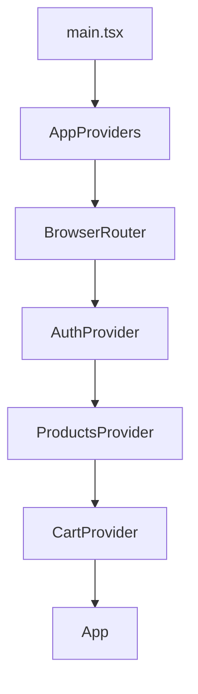

# MUNDO — E-commerce Kickoff (Módulo 5)

Bases arquitectónicas de un e-commerce escalable, construidas con **Vite + React 18 + TypeScript** y **Context API** como estado global.

Esta entrega corresponde a la Homework de la Clase 1 del Módulo 5. El objetivo de esta etapa es establecer las bases arquitectónicas del e-commerce —capas, contexts, hooks con guards, tipado y testing— y no desarrollar todavía una tienda funcional completa.

## Stack

* React 18 + TypeScript + Vite
* React Router DOM (navegación)
* Tailwind CSS v4 (tokens de diseño de MUNDO — paleta, tipografías Baloo 2 / Nunito, radios, sombras)
* Context API (estado global)
* Vitest + React Testing Library (tests)
* ESLint (typescript-eslint + react-hooks + react-refresh)

El proyecto está pensado para escalar en los próximos módulos con **Firebase Authentication + Firestore**, **AWS S3** para imágenes y **Vercel** para el deploy.

Por este motivo, `services/` existe como una carpeta reservada aunque actualmente no tenga contenido. Será la capa destinada a las integraciones externas, permitiendo mantener esa lógica separada de los contexts y componentes y facilitando la futura transición de mocks a servicios reales.

## Cómo correr el proyecto

```bash
npm install
npm run dev          # servidor de desarrollo
npm run test:run     # corre los tests una vez
npm run test         # tests en modo watch
npm run lint         # ESLint
npm run build        # build de producción
```

## Estructura de carpetas

```text
src/
  components/        # componentes de dominio y layout
    layout/          # estructura de página (Header, etc.)
    ui/              # piezas genéricas reutilizables, sin lógica de negocio
  contexts/          # Context + Provider de cada dominio y AppProviders
  hooks/             # custom hooks de consumo, con guard fuera del Provider
  pages/             # componentes de página
  services/          # integraciones externas (reservada para próximos módulos)
  types/             # contratos de TypeScript compartidos

test/
  hooks/             # tests de guard de cada hook
  contexts/          # tests de integración entre providers
```

## Árbol de Providers



### Justificación del orden

El orden `AuthProvider → ProductsProvider → CartProvider` no es arbitrario.

`CartProvider` necesita poder leer `useAuth()` para implementar el carrito por usuario: cada `uid` tiene su propio carrito y un usuario no autenticado utiliza un carrito identificado como `"guest"`.

Como React resuelve el contexto más cercano hacia arriba en el árbol, `CartProvider` debe estar anidado dentro de `AuthProvider` para poder utilizar `useAuth()` sin activar el guard del hook.

Si el orden se invirtiera, `useAuth()` llamado desde `CartProvider` lanzaría el error correspondiente a un uso fuera de `AuthProvider`.

`ProductsProvider` no depende actualmente de `Auth` ni de `Cart`, por lo que su posición intermedia no responde a una dependencia estricta.

## Justificación de capas

* **`types/`**: contiene los contratos (`Product`, `CartItem`, `User`) utilizados por contexts, hooks y componentes. Se definieron desde el comienzo para establecer un lenguaje común entre las distintas capas.

* **`contexts/`**: cada Context vive junto a su Provider en el mismo archivo (`AuthContext.tsx`, `CartContext.tsx`, `ProductsContext.tsx`). Esta fue una decisión consciente para evitar separar archivos que actualmente tienen poca complejidad. `AppProviders.tsx` también vive aquí porque su única responsabilidad es componer los distintos providers.

* **`hooks/`**: contiene los custom hooks de consumo (`useAuth`, `useCart`, `useProducts`). Se mantienen separados de los contexts porque tienen una responsabilidad diferente: encapsular el consumo seguro del estado mediante guards.

* **`components/`**: contiene componentes de dominio que conocen los tipos del negocio (`ProductCard`, `ProductGrid`) y componentes de layout. Se subdivide en `layout/`, para la estructura de las páginas, y `ui/`, reservada para piezas genéricas reutilizables sin lógica de negocio.

* **`pages/`**: contiene los componentes correspondientes a pantallas completas, que componen otros componentes de la aplicación.

* **`services/`**: permanece vacía por ahora de forma intencional. Será la capa destinada a las integraciones con servicios externos como Firebase o AWS.

* **`test/`**: se encuentra separada de `src/` y replica parcialmente la estructura interna del proyecto. Esta organización responde a una decisión personal de mantener los tests agrupados y separados del código de producción.

## Qué hice distinto y por qué

* **Hooks separados de los Contexts:** se creó una carpeta `hooks/` propia, en lugar de definir los hooks de consumo dentro de los mismos archivos de los Contexts. Esto permite separar "cómo se comparte el estado" de "cómo se consume de forma segura" y facilita testear los guards de manera aislada con `renderHook`.

* **Tests separados de `src/`:** se utiliza una carpeta `test/` independiente, replicando la estructura interna, en lugar de co-ubicar los tests junto a cada archivo. Es una decisión de organización personal basada en la consistencia con proyectos anteriores.

* **Convención de nombres por tipo:** se utilizan nombres como `AuthContext.tsx`, `useAuth.ts` y `product.types.ts`, en lugar de organizar los archivos por dominio mediante subcarpetas y barrel files. Esta alternativa fue evaluada y descartada porque agregaría estructura innecesaria para el tamaño actual del proyecto.

* **Conventional Commits:** se adoptó esta convención desde el primer commit para mantener un historial claro y clasificado según el tipo de cambio.

* **`CartItem` con `Product` embebido:** se decidió mantener el objeto `Product` completo dentro de `CartItem`, en lugar de guardar únicamente `productId`. Se evaluó la alternativa de guardar solo el identificador para evitar posibles datos desactualizados, pero se mantuvo la estructura utilizada en el curso por el momento.

* **Carrito para invitados:** los usuarios pueden armar un carrito sin iniciar sesión utilizando la clave `"guest"`. La autenticación se exigirá posteriormente al momento de continuar con el checkout, reduciendo la fricción durante la navegación.

* **`displayName` opcional:** el tipo `User` utiliza `displayName?: string` en lugar de un `name` obligatorio. Se eligió este nombre para mantener consistencia con Firebase Authentication y se dejó como opcional para contemplar el caso en que el usuario no tenga un nombre disponible.

* **`uid` en `User`:** se utiliza `uid` en lugar de `id` para mantener consistencia con el identificador utilizado por Firebase Authentication y evitar un remapeo innecesario en una futura integración.

## Bitácora de IA

Durante el desarrollo se utilizó IA como herramienta de apoyo para analizar decisiones arquitectónicas, revisar modelos de datos, comprender errores, evaluar alternativas de implementación y validar buenas prácticas.

La IA no se utilizó como reemplazo del desarrollo, sino como una herramienta para comparar opciones, comprender sus consecuencias y tomar decisiones de manera fundamentada.

El registro completo de prompts, respuestas, decisiones tomadas y alternativas descartadas se encuentra en [`bitacora_ia.md`](./bitacora_ia.md).

Algunos de los principales temas trabajados fueron:

* Definición de una arquitectura Layer-based.
* Convenciones de nombres y commits.
* Diseño de los tipos `Product`, `CartItem` y `User`.
* Manejo del carrito para usuarios autenticados e invitados.
* Composición y orden de los Providers.
* Optimización de `CartContext` utilizando `useMemo` y `useCallback`.
* Revisión y testing de hooks con guards.
* Validación de decisiones antes de incorporar cambios al código.

### Principales decisiones analizadas con IA

**Modelo de datos:** se revisaron los tipos `Product`, `CartItem` y `User`, evaluando campos, optionality, relaciones y naming en función de la futura integración con Firebase.

**Composición de Providers:** se analizó el orden de `AppProviders`, identificando la dependencia de `CartProvider` respecto de `AuthProvider`, y se evaluaron distintas alternativas de organización.

**Optimización de `CartContext`:** al utilizar `useMemo` para memorizar el `value` del contexto, ESLint detectó dependencias faltantes. En lugar de eliminar el warning, se analizó la causa y se aplicó `useCallback` a las acciones del carrito para mantener referencias estables y hacer efectiva la memoización.

Las decisiones completas, incluyendo las propuestas aceptadas, rechazadas y el razonamiento detrás de cada una, están documentadas en `bitacora_ia.md`.
